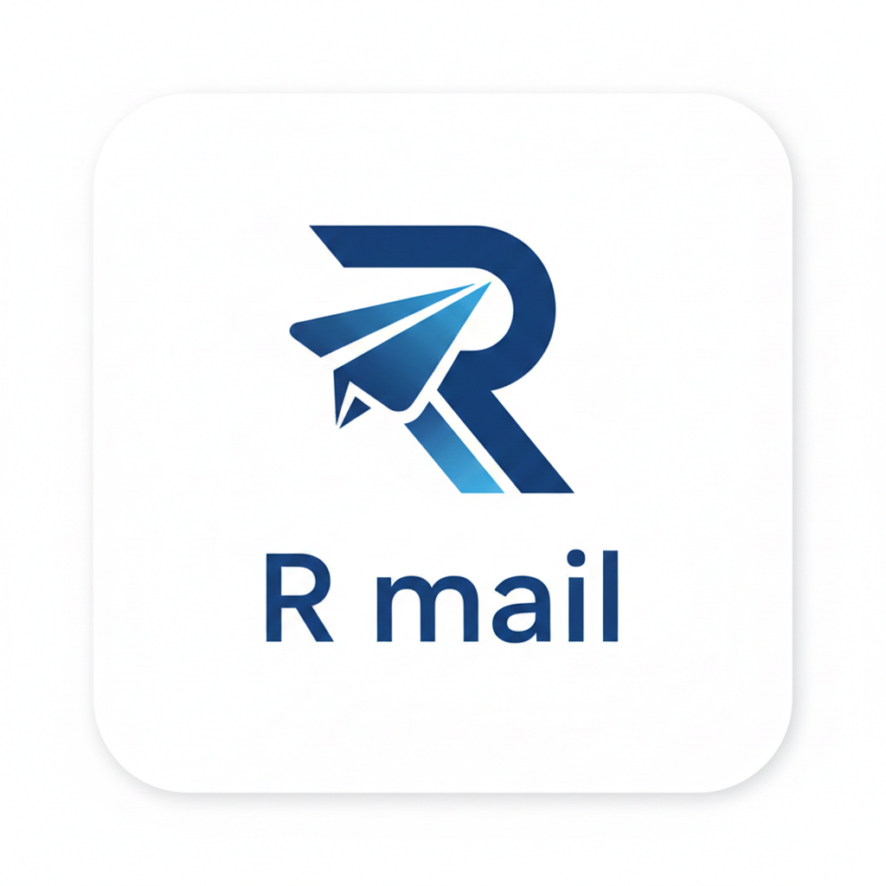

<p align="center">
  
</p>

<h1 align="center">Rmail</h1>
<p align="center"><strong>AI-Powered Email Client</strong></p>
<p align="center">A modern, full-stack Gmail client with an intelligent AI assistant, real-time sync, and a premium glassmorphism interface.</p>

---

## Features

### Core Email
- **Full Gmail Integration** — Read, send, reply, forward, and star emails using the Gmail API
- **Rich HTML Rendering** — Renders full HTML emails in a sandboxed iframe with auto-resize
- **Threaded Conversations** — Collapsible thread view with inline quick-reply
- **Real-time Sync** — WebSocket-based live notifications + background polling for new emails
- **Email Forwarding** — Forward individual messages or entire threads with full metadata

### AI Assistant
- **Context-Aware** — Understands current view, selected email, active filters, and connected account
- **Action Execution** — Can navigate views, compose emails, apply filters, open emails, and draft replies
- **Persistent Chat** — Chat history stored and restored across sessions
- **Powered by Gemini** — Uses Google Gemini API for natural language understanding

### Search & Filters
- **Multi-criteria Filtering** — Filter by sender, keyword, date range, and read/unread status
- **Instant Search** — Quick search bar in sidebar with keyword matching across subject, body, and preview
- **Filter Chips** — Visual filter indicators with individual clear buttons

### Design
- **Glassmorphism UI** — Frosted glass effects with backdrop blur and soft shadows
- **Dark/Light Mode** — Full theme support with persistent toggle
- **Indigo/Violet Palette** — Curated color system with gradient accents
- **Micro-animations** — Smooth transitions, fade-ins, floating orbs, and scale effects
- **Typography** — Plus Jakarta Sans for headings, Inter for body text

### Security
- **OAuth 2.0** — Google OAuth with secure token refresh
- **Token Storage** — Encrypted tokens persisted in MongoDB
- **Session Persistence** — No re-login required on page refresh
- **Sandboxed Rendering** — HTML emails rendered in isolated iframes

---

## Architecture

```
┌──────────────────────────────────────────────────────────────────┐
│                        FRONTEND (React)                          │
│  ┌──────────┐ ┌──────────┐ ┌──────────┐ ┌──────────┐            │
│  │  Login   │ │ Sidebar  │ │  Email   │ │    AI    │            │
│  │  Page    │ │ + Filter │ │  Detail  │ │ Assistant│            │
│  └──────────┘ └──────────┘ └──────────┘ └──────────┘            │
│       │            │             │             │                  │
│       └────────────┴─────────────┴─────────────┘                 │
│                         │                                        │
│                   MailContext.js                                  │
│            (Global State + Auth + Theme)                         │
└────────────────────────┬─────────────────────────────────────────┘
                         │  HTTP REST + WebSocket
┌────────────────────────┴─────────────────────────────────────────┐
│                     BACKEND (FastAPI)                             │
│                                                                  │
│  ┌────────────────────────────────────────────────────────────┐  │
│  │                    server.py                                │  │
│  │  ┌──────────┐ ┌──────────┐ ┌──────────┐ ┌──────────────┐  │  │
│  │  │  Auth    │ │  Email   │ │   AI     │ │  WebSocket   │  │  │
│  │  │  Routes  │ │  Routes  │ │  Routes  │ │  Handler     │  │  │
│  │  └────┬─────┘ └────┬─────┘ └────┬─────┘ └──────────────┘  │  │
│  └───────┼────────────┼────────────┼──────────────────────────┘  │
│          │            │            │                              │
│  ┌───────┴────────────┴────────────┴──────────────────────────┐  │
│  │                 gmail_service.py                             │  │
│  │        (Gmail API wrapper — fetch, send, parse)             │  │
│  └─────────────────────┬──────────────────────────────────────┘  │
└────────────────────────┼─────────────────────────────────────────┘
                         │
          ┌──────────────┼──────────────┐
          ▼              ▼              ▼
   ┌────────────┐ ┌────────────┐ ┌────────────┐
   │  MongoDB   │ │  Gmail API │ │  Gemini AI │
   │ (emails,   │ │  (OAuth2)  │ │  (chat &   │
   │  tokens,   │ │            │ │   actions) │
   │  chat)     │ │            │ │            │
   └────────────┘ └────────────┘ └────────────┘
```

---

## System Design

### Data Flow

1. **Authentication** — User clicks "Continue with Google" → OAuth redirect → backend exchanges code for tokens → tokens stored in MongoDB → subsequent requests authenticated via refresh token
2. **Email Sync** — On startup, backend fetches last 50 inbox + 30 sent emails from Gmail API → parsed and stored in MongoDB with both text and HTML bodies → frontend fetches from MongoDB (not Gmail) for fast loading
3. **Real-time Updates** — Backend polls Gmail every 30 seconds for new emails → new emails pushed to frontend via WebSocket → instant notification without page refresh
4. **AI Processing** — User message + context (current view, selected email, filters, account) sent to Gemini → response parsed for both text reply and structured actions → actions auto-executed on frontend

### Database Schema (MongoDB)

| Collection | Purpose | Key Fields |
|------------|---------|------------|
| `emails` | Cached Gmail messages | `gmail_id`, `thread_id`, `from_email`, `to_email`, `subject`, `body`, `body_html`, `date`, `is_read`, `starred`, `folder` |
| `tokens` | OAuth refresh tokens | `email`, `refresh_token`, `updated_at` |
| `chat_history` | AI conversation log | `role`, `content`, `actions`, `timestamp` |

### Key Design Decisions

- **MongoDB as cache layer** — Emails are synced from Gmail to MongoDB on login. All reads come from MongoDB for instant response. Gmail API is only hit for send/reply/forward operations and background sync.
- **HTML email isolation** — HTML emails rendered in sandboxed `<iframe>` elements with `allow-same-origin` only — no scripts, forms, or navigation allowed.
- **Stateless backend** — No server-side sessions. Auth state is derived from stored tokens on each startup. Frontend persists theme preference in localStorage.
- **AI action system** — AI responses include structured `actions[]` array that the frontend interprets and executes (navigate, compose, filter, etc.), making the AI capable of controlling the entire UI.

---

## Tech Stack

| Layer | Technology | Purpose |
|-------|-----------|---------|
| Frontend | React 18 | UI components and rendering |
| Styling | Tailwind CSS + CSS Variables | Design system with theme support |
| Icons | Lucide React | Consistent icon system |
| Backend | FastAPI (Python) | REST API and WebSocket server |
| Database | MongoDB + Motor | Async document storage |
| Email | Gmail API + OAuth 2.0 | Email operations |
| AI | Google Gemini API | Natural language chat + actions |
| Real-time | WebSocket | Live email notifications |

---

## Project Structure

```
mail/
├── backend/
│   ├── server.py              # FastAPI app — routes, auth, WebSocket, AI
│   ├── gmail_service.py       # Gmail API wrapper — fetch, send, parse MIME
│   └── requirements.txt       # Python dependencies
├── frontend/
│   ├── public/
│   │   ├── index.html         # Entry HTML with fonts and favicon
│   │   └── logo.png           # App logo
│   └── src/
│       ├── App.js             # Root with auth gate and lazy loading
│       ├── index.css           # Design system — CSS variables, themes, animations
│       ├── contexts/
│       │   └── MailContext.js   # Global state management
│       └── components/
│           ├── LoginPage.js    # OAuth login with animations
│           ├── Sidebar.js      # Navigation, filters, profile tooltip
│           ├── EmailList.js    # Inbox/sent list view
│           ├── EmailDetail.js  # Thread viewer with HTML iframe rendering
│           ├── ComposeModal.js # Compose, reply, forward
│           └── AIAssistant.js  # AI chat bar with command execution
├── .env                        # Environment variables (not committed)
├── .gitignore
└── README.md
```

---

## Quick Start

```bash
# Backend
cd backend
pip install -r requirements.txt
uvicorn server:app --host 0.0.0.0 --port 8001 --reload

# Frontend (separate terminal)
cd frontend
yarn install
PORT=3000 yarn start
```

Open **http://localhost:3000** and sign in with Google.

---

## Author

**Rahul Yadav**
[rahul-yadav.com.np](https://rahul-yadav.com.np/)

---

© 2026 Rahul Yadav. All rights reserved.
